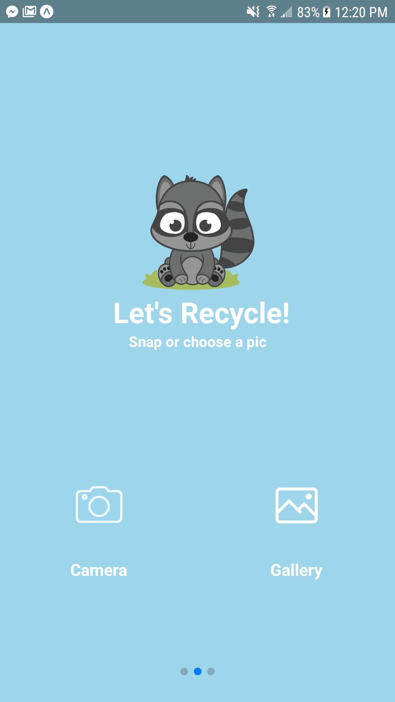
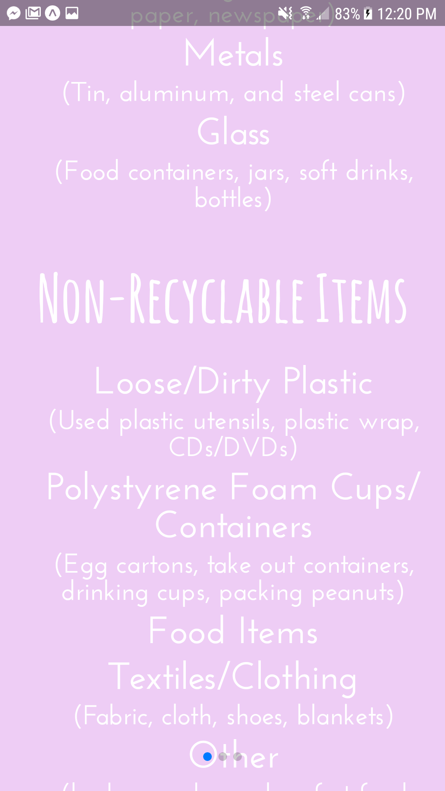
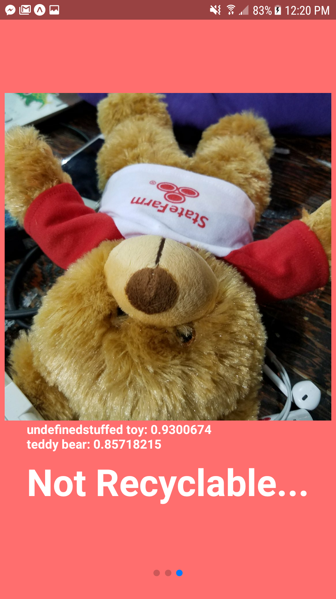

We went from not knowing a line of react-native to some nice UI and functionality. Although the algorithm is a bit buggy for detecting if items are recyclable, we are pretty proud of the (cute) result!

